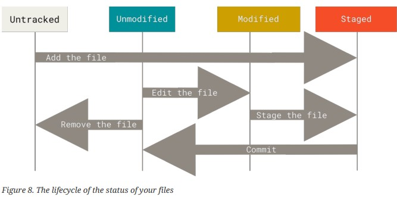

# High Level Overview of Data structure of algorithms
## Time Complexity
Time complexity is the time taken by an algorithm/program to run as a function of the length of the input
- Time complexity helps in comparing efficiency between two algorithms
- This analysis is independent of the machine's parameters and only on the length of input.

### Asymptotic notation
Asymptotic notations are mathematical notations which are used to describe the running time of an algorithm when input tends towards infinity.

1. **Big-O notation**: The Big-O notation describes the worst-case running time of an algorithm. It is computed by counting the number of operations it will take in the worst-case scenario with the input ‘n’.
$$
O(g(n)) = { f(n): there exist positive constants c and n0
           such that 0 ≤ f(n) ≤ cg(n) for all n ≥ n0 }
$$
2. **Big Omega() notation**: The notation describes the best running time of an algorithm. It is computed by counting the number of operations it will take in the best-case scenario with the input ‘n’.
$$
Ω(g(n)) = { f(n): there exist positive constants c and n0 
           such that 0 ≤ cg(n) ≤ f(n) for all n ≥ n0 }
$$
3. **Big Theta() Notation**: The theta notation encloses the function from above and below, therefore it defines the exact asymptotic behaviour. The notation is used for analyzing the average runtime of an algorithm.
$$
Θ(g(n)) = { f(n): there exist positive constants c1, c2 and n0
           such that 0 ≤ c1g(n) ≤ f(n) ≤ c2g(n) for all n ≥ n0 }
$$

Big-O notation helps
- Desribe the limiting behavior of the function
- characterises a function based on growth of function
- Upper bound on growth rate of the function

n being the number of test cases
- O(1)	Constant Time Complexity\
Example: Sum of two numbers.
- O(logn)	Logarithmic Time Complexity\
Example: Finding an element in a sorted - array by using binary search.
- O(n)	Linear Time Complexity\
Example: Finding the sum of an array of size n.
- O(n logn)	Log-Linear Time Complexity\
Example: Sorting the array using merge sort.
- O(n2)	Quadratic Time Complexity\
Example: Finding the sum of every pair of elements in an array.
- O(2^n) Exponential Time Complexity\
Example: Finding all the subsets.
- O(n!)	Factorial Time Complexity\
Example: Finding all the permutations of a given array.

We generally use big-O notation because it provides a way to understand the algorithm for very large size input and at the worst case scenario.

Examples\
1. 
```
int count = 0;
for (int i = N; i > 0; i /= 2) {
    for (int j = 0; j < i; j++) {
        count += 1;
    }
}
//If you think TC is O(N*N) or O(N logN) then you are wrong
//time Complexity is O(N)
```
#### explanation
consider the inner loop\
for i = N, j run from 1 to N;\
for i = N/2, j run from 1 to N/2 thus total number iterations are
$$ N + N/2 + N/3 + ..... + 1 = N(1 + 1/2 + 1/3 + ..... + 1/N) $$
$$ N + N/2 + N/3 + ..... + 1 = 2*N ---- O(N) $$ 
the sum of 1/N series.

----------

2.
```
int i, j, k = 0;
for (i = n/2; i <= n; i++) {
    for (j = 2; j <= n; j = j * 2) {
         k = k + n/2;
    }
}
//time comlexity is O(N LogN)
```
 #### explanation
 from first loop, i starts from N/2 to N at a step 0f 1
 the second loop, start from i to N exponentially
 $$ i -> i*2 -> i*2*2 -> i*2*2*2 - ....... $$
 This continues till i is less than N, thus LogN definition states the number of time a number can be divided by the specified base number till it becomes near to zero. [**alternate definition** :- Number of times, you can double a number till it is less than n would be log(n)].\
 The sum of operations are
 $$ logN + logN + logN + ........ i-times [N/2, N] $$
 $$ N/2 * logN = O(N*logN) $$

----------

3. 
consider the below code
```
if(int i = n; i > -1; i/=2){
    <statements>;
}

//the loop runs for infinite times
```

#### explanation
Here the terminating condition is that i to be greater than -1. The iteration is i getiing deivided by two. Thus when i get to zero the condition i>-1 will keep satisfying after that as 0/2 = 0.

-------

# DVCS [Distributed Version Control System]
Software development takes ton of coding and many developers. It is also important that they collaborate together to make it possible. Version control systems are specific software that keeps track of changes as storing versions of file (as snapshots in GIT). Distributed VCS are the one's where everything is distributed instead of being in a central location. Every developer gets to copy the entire version history and the code together, then changes are made locally.

In GIT, clone a repository means copying the entire code base along with the local machine to the local device and then making changes locally. The changes then can be commited to the central repository for merging. 
- GIT is fast
- Doesn't require internet

Git handles code changes with security too. Every change is encoded with checksum file. That has SHA1 encrypted codec that matches with vesrion. In general, if there is any change made then git will know about it

GIT maintains three states:

1. **Modified**: The changed files, stored as snapshots.
2. **Stsged**: The modified files that are made available for the next commit. This state is also called indexed.
3. **Committed**: The data that is finally stored in the database.



You can use git-config CLI tool that can set general configuration properties on your system.

```$ git config --list --show-origin```\
```$ git config --global user.name <specify username>```

## Project with GIT
There are two ways to start a project with GIT
1. Clone a repository.
2. Make a normal directory to be under git control.

Let's see for the second one. Navigate to the directory and run the few add commands and make the first commit.